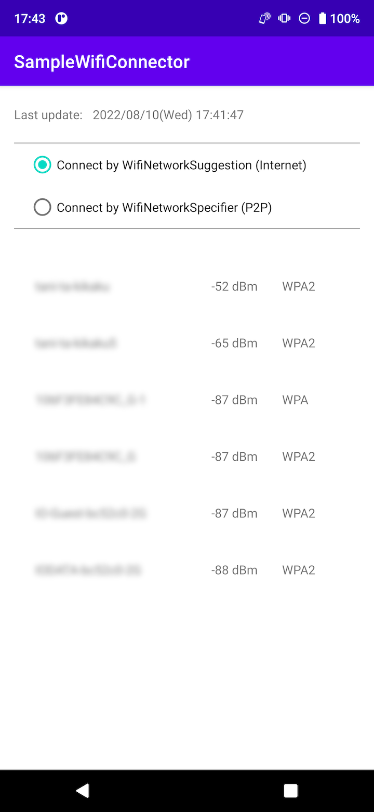
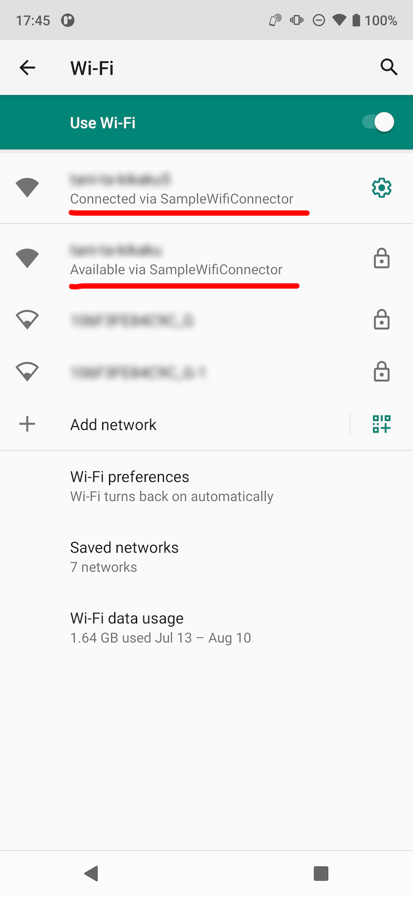
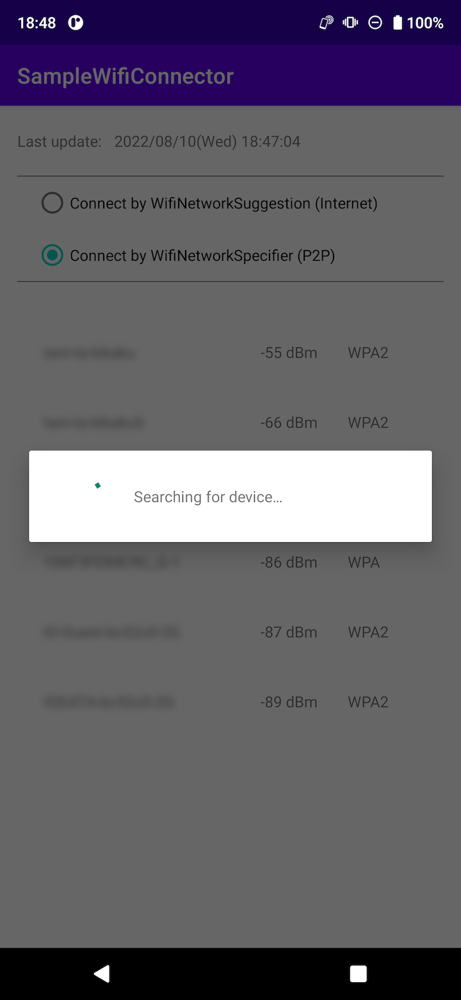
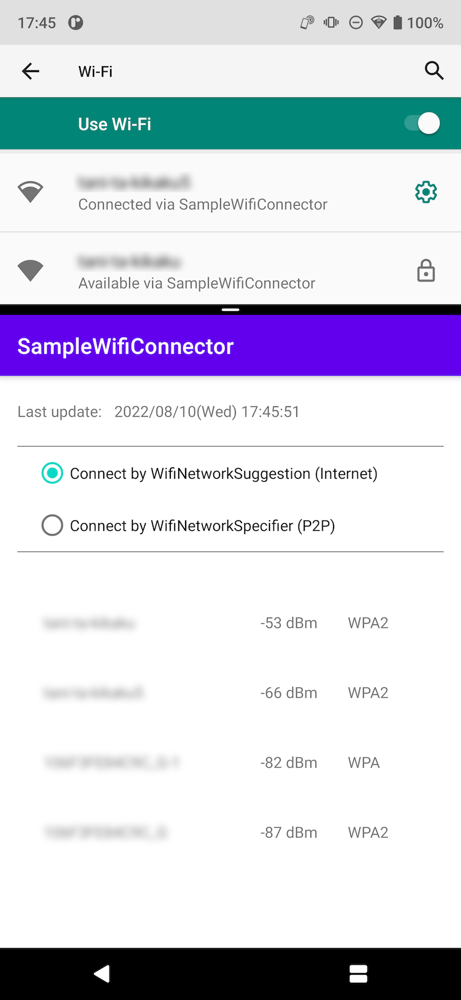

# SampleWifiConnector

This is an Android sample code for using WifiNetworkSuggestion and WifiNetworkSpecifier.

If JDK error happens, set your Android Studio to use Gradle JDK 11. 
[Preferences] > [Build, Execution, Deployment] > [Build Tools] > [Gradle]

---
#### WifiNetworkSuggestion
[https://developer.android.com/guide/topics/connectivity/wifi-suggest](https://developer.android.com/guide/topics/connectivity/wifi-suggest)

WifiNetworkSuggestion is used to add some Wi-Fi access points to a phone as internet connection choices. (Other apps can also use the connection)

NOTICE: The Wi-Fi access point used for internet connection is determined by the Android OS, so even if you add some Wi-Fi access points, they may not be used immediately.

&emsp;
&emsp;
&emsp;

---
#### WifiNetworkSpecifier
[https://developer.android.com/guide/topics/connectivity/wifi-bootstrap](https://developer.android.com/guide/topics/connectivity/wifi-bootstrap)

WifiNetworkSpecifier is used to connect only with your app to the specified Wi-Fi. (Other apps can not use the Wi-Fi)

&emsp;
&emsp;
&emsp;  
&emsp;
&emsp;
&emsp;

---
This app has a list of Wi-Fi access points around you, but on recent Android OS, it is updated less frequently to reduce battery consumption. To check for updates of the list (the WifiManager's broadcast onReceive), launch the Wi-Fi setting screen at the same time with the split screen feature. When the screen is up, the  broadcast comes every 10 seconds.

&emsp;
